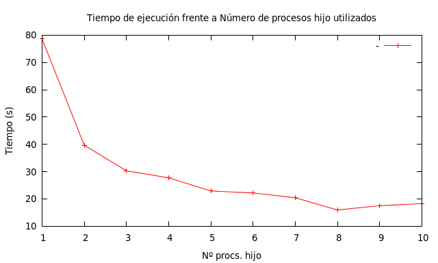

# Multi Process Simulation

Este repo contiene una **ampliación de una práctica** correspondiente a la asignatura
_"Planificación y Simulación de Redes"_ de GITT.

## Motivación
Tenía curiosidad por probar alguna simulación utilizando varios núcleos del procesador (porque vi que normalmente sólo se utiliza uno) con el objetivo de mejorar el tiempo de simulación.

Para ello se han utilizado algunos de los conceptos aprendidos en _"Sistemas Operativos"_ (procesos hijo, tuberías...).

## Resultados
Se obtiene, como era de esperar, una importante mejora de rendimiento:



## Ejecución de las pruebas
Para ver las conclusiones (y generar una gráfica para ver los resultados) se realiza una batería de pruebas donde se van variando el número de procesos hijos que se ejecutan de forma paralela.
Para ello, la ejecución sería la siguiente:

```shell
./ejecutaPrueba.sh
./generaPlot.sh
```

### Breve explicación del funcionamiento de la ampliación
Los procesos hijo son los que se encargan de realizar las simulaciones en sí y envían los resultados a través de una tubería al proceso padre que es quien genera el fichero plot. En cada simulación simple se utiliza una semilla diferente para que los resultados varíen de una simulación a la siguiente.


### Soluciones alternativas:
- El simulador de redes **ns3** ofrece métodos para trabajar con hilos pero no he conseguido sincronizar el planificador.

- Otra posible solución sería ejecutar múltiples simulaciones directamente desde la shell teniendo especial cuidado en **variar la semilla** de cada una de las ejecuciones.
